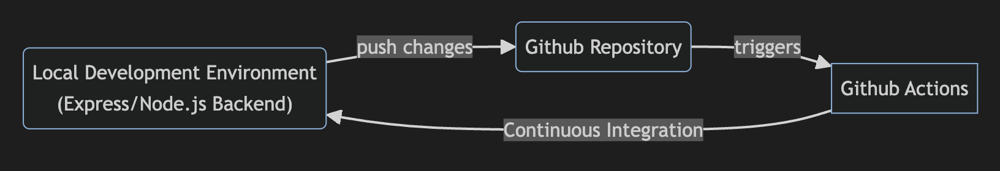

# Restaurant API

This API is meant to serve a fictitious restaurant menu application. It is meant to only be used in a development environment and is really just a representation of how to develop an API using GraphQL and Node.js.

# Overview

This repository contains all of the files needed to run the API. As mentioned before the application is only meant to be run in a developmental capacity, but it can be made production ready.

There is a CI pipeline in place that was created using Github Actions in order to test the application outside of a local development environment. 

# System Design


The architecture and design for the application are as follows:

- *** ExpressJS Web Framework ***
    - The Express Web Application Framework is used to handle all of the server logic and routing. This framework was chosen becuase it is lightweight and un-opinionated

    - Within Express, the *** Factory design pattern *** is used to allow for seamless deployment into different environments, in this case development and testing. This is especially useful because the development and test environemnt should not be using the same database. As seen in the code, before the application is created, the user needs to specify the ENVIRONMENT that they wish to run in.

- *** GraphQL ***

- *** SQLite ***
    - Since this is not a production application, SQLite was chosen as the database as it requires little to no setup by the user. All that is required is either a path so the database file can be created or a ":memory:" argument so that the files just runs in-memory.

    - Note that SQLite is not meant to be used in a prodution setting so a new database would have to be chosen if the end-goal is to launch the application in a production environemnt

Aside from this, it is important to note that this application is purposefully missing specific libraries/components. For instance, there is no use of CORS, Server-side Sessions, or environmental variables to mask settings within the application. The application is a local project and so the ideas above were deemed out of scope.

# Database Design

# Testing

The Jest Testing Framework was used to test this application. All tests can be found in the "./_tests_" directory and can be run using the ```npm run test``` command. The results and coverage of all the tests will be outputted to the console. While Jest is often used to test JavaScript, this application tests the Typescript files by utilizing the ts-jest library.

In addition to using Jest, manual testing was conducted using the Postman API application and DataGrip application as needed
- Postman helped to verify whether errors were due to programming logic or invalid API calls.

- DataGrip provides a rich GUI that allows you to interact with your database

# Project Replication

In order to run this program you will need to install NodeJS onto your computer. Any version past V18 will work. The download page is provided for convenience (https://nodejs.org/en/download)

Once you have NodeJS installed simply follow the instructions below:

1. Clone the github repository onto your machine

2. Use the terminal to navigate to the directory where the files were cloned and run ```npm install``` in order to download all the required dependencies

3. Once the dependencies are installed you can start the server one of two ways
    - You can run ```npm run start``` which will trigger Node to precompile all of the Typescript into Javascript before the server is started. Unlike the option below, changes to the codebase will not force the server to restart
    
    - You can run ```npm run dev``` which will instead trigger Node to compile all of the files at runtime. This option uses ```nodemon``` so any changes to the codebase will automatically restart the server

4. With that your instance should be up and running and the server can be reached at http://localhost:4000