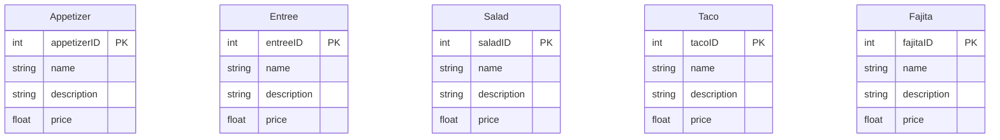

```mermaid
    erDiagram
    Appetizer{
        int appetizerID PK
        string name
        string description
        float price
    }

    Entree{
        int entreeID PK
        string name
        string description
        float price
    }

    Salad{
        int saladID PK
        string name
        string description
        float price
    }

    Taco{
        int tacoID PK
        string name
        string description
        float price
    }

    Fajita{
        int fajitaID PK
        string name
        string description
        float price
    }
```