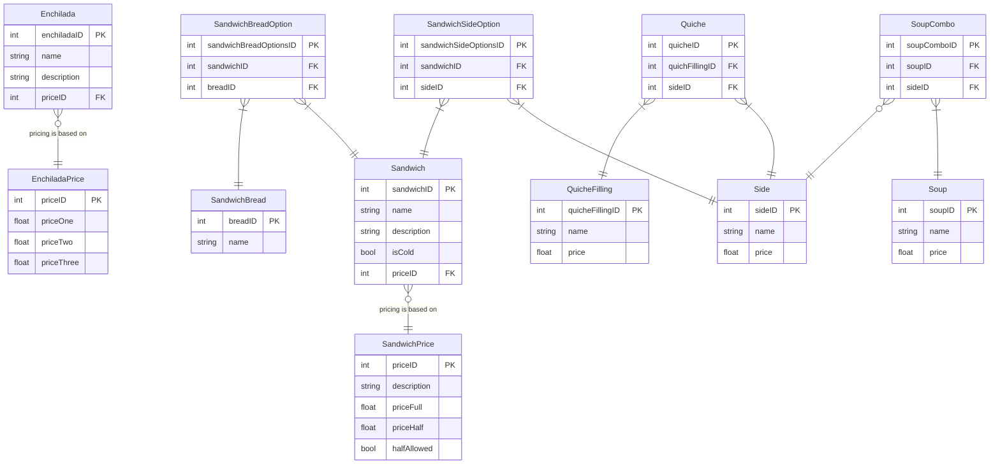

```mermaid
   erDiagram

   Enchilada{
        int enchiladaID PK
        string name
        string description
        int priceID FK
    }
    EnchiladaPrice{
        int priceID PK
        float priceOne
        float priceTwo
        float priceThree
    }

    Sandwich{
        int sandwichID PK
        string name
        string description
        bool isCold
        int priceID FK
    }

    SandwichPrice{
        int priceID PK
        string description
        float priceFull
        float priceHalf
        bool halfAllowed
    }

    SandwichBread{
        int breadID PK
        string name
    }

    SandwichBreadOption{
        int sandwichBreadOptionsID PK
        int sandwichID FK
        int breadID FK
    }

    SandwichSideOption{
        int sandwichSideOptionsID PK
        int sandwichID FK
        int sideID FK
    }

    Quiche{
        int quicheID PK
        int quichFillingID FK
        int sideID FK
    }

    QuicheFilling{
        int quicheFillingID PK
        string name
        float price
    }

    Side{
        int sideID PK
        string name
        float price
    }

    SoupCombo{
        int soupComboID PK
        int soupID FK
        int sideID FK
    }

    Soup{
        int soupID PK
        string name
        float price
    }
    
    Quiche }|--|| Side : ""
    Quiche }|--|| QuicheFilling : ""
    SoupCombo }|--|| Soup : ""
    SoupCombo }o--|| Side : ""
    Enchilada }o--|| EnchiladaPrice : "pricing is based on"
    Sandwich }o--|| SandwichPrice : "pricing is based on"
    SandwichBreadOption }|--|| Sandwich : ""
    SandwichBreadOption }|--|| SandwichBread : ""
    SandwichSideOption }|--|| Side : ""
    SandwichSideOption }|--|| Sandwich : ""
```