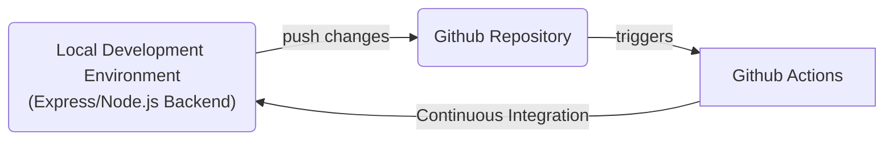

```mermaid
    flowchart LR;
    A("Local Development Environment\n(Express/Node.js Backend)");
    A--push changes-->B(Github Repository);
    B--triggers-->C[Github Actions];
    C--Continuous Integration-->A;
```